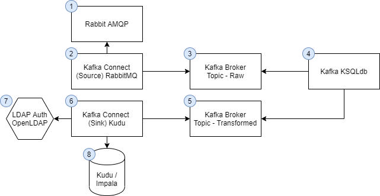
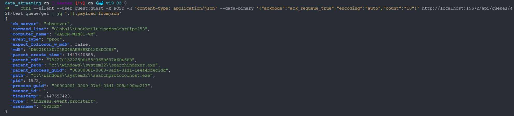
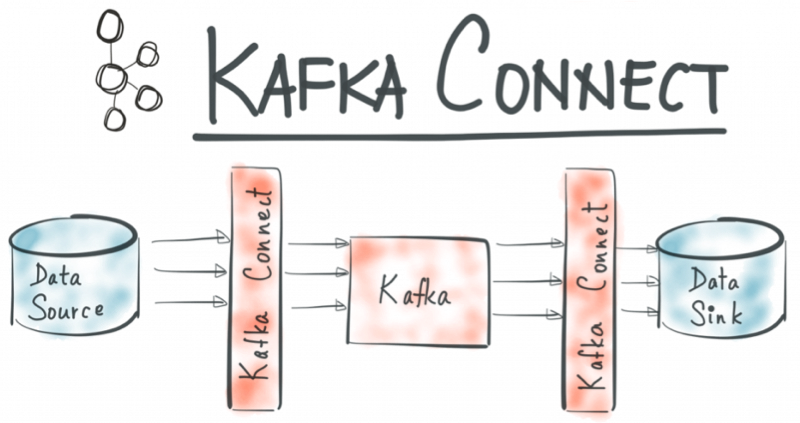
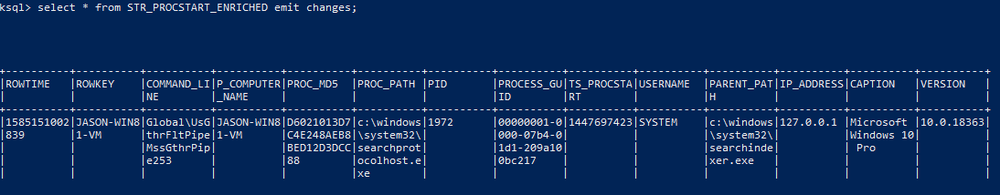
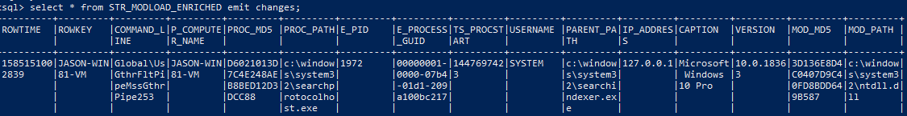

# Data Streaming

- [Data Streaming](#data-streaming)
  - [Introduction](#introduction)
    - [Known gaps and limitations](#known-gaps-and-limitations)
    - [Mapped Ports](#mapped-ports)
  - [Prerequisites](#prerequisites)
  - [Beginner Guide](#beginner-guide)
    - [Start the services](#start-the-services)
    - [Configure Rabbit](#configure-rabbit)
    - [Configure Kafka Connect](#configure-kafka-connect)
  - [Checkpoint 1](#checkpoint-1)
  - [KSQLdb](#ksqldb)
  - [Advanced streaming](#advanced-streaming)
    - [Create Module Load Events](#create-module-load-events)
      - [Kafka Topic](#kafka-topic)
      - [Create the KSQL stream](#create-the-ksql-stream)
      - [Create a computer name keyed stream](#create-a-computer-name-keyed-stream)
      - [Send some records](#send-some-records)
    - [Create OS Info Events](#create-os-info-events)
      - [Create the topic](#create-the-topic)
      - [Create KSQL stream](#create-ksql-stream)
      - [Keyed stream (rowkey = computer_name)](#keyed-stream-rowkey--computer_name)
    - [Create the KSQL table](#create-the-ksql-table)
      - [Pump across a record](#pump-across-a-record)
  - [Create enriched procstart stream](#create-enriched-procstart-stream)
  - [Create enriched modload stream](#create-enriched-modload-stream)
  - [Kafka Connect - Kudu Sink](#kafka-connect---kudu-sink)

## Introduction
This project creates a collection of containers wrapped via docker-compose to generate a data streaming and transformation pipeline.

Docker will spin up:
- Rabbit AMQP broker
- Kafka Broker
- Kudu Masters (x3)
- Kudu tablet servers. Default of 1, but can scale +- with docker-compose up --scale kudu-tserver=3
- Impala Server (impalad, statestore, catalogd, hive metastore)
- NiFi Server
- Kafka KSQLdb
- Kafka KSQLdb cli host
- Kafka Schema Registry
- Kafka Connect
- Zookeeper
- OpenLDAP directory service

The Docker containers shall form a virtual bridged network named: "streaming".




The data streaming message flow is as follows:
1. Publish JSON message to Rabbit queue
2. Kafka Connect consumes the message from Rabbit and publishes to a Kafka topic
3. Kafka KSQLdb reads from the Kafka topic, performs transformations, and publishes to a secondary topic
4. Kafka Connect (Sink) reads from the secondary topic and publishes to Kudu/Impala with LDAP authentication

### Known gaps and limitations
This is just a POC with security being an afterthought/lacking. There is no crypto or kerberos auth. There is no authorisation. This is just a POC and not fit for production use.

**There is NOT DATA PERSISTANCE!**

### Mapped Ports
- **Service:Local host port:Internal Port**
- ldap:3890:389
- ksqldb-server:18088:8088
- kafka-connect:8083:8083
- kafka:9092:9092
- nifi:8080:8080
- impala:
- schemaregistry:8081:8081
- rabbit:15672:15672
- rabbit mgmt:5672:5672

## Prerequisites
- Docker
- docker-compose
- curl
- jq (Optional, for pretty printing out json payloads)

Ideally, you will also have VS Code and WSL. 

You need to confirm that Docker has at least 8GB of memory available to it:

    docker system info | grep Memory 

Should return a value greater than 8GB - if not, the Kafka stack will probably not work.

## Beginner Guide
### Start the services
Spin up the containers:

	docker-compose up -d

### Configure Rabbit
Create a rabbit queue named test_queue:

	curl --user guest:guest -X PUT -H 'content-type: application/json' --data-binary '{"vhost":"/","name":"test_queue","durable":"true","auto_delete":"false","arguments":{"x-queue-type":"classic"}}' http://localhost:15672/api/queues/%2F/test_queue

What's that whack %2F mean? The default virtual host is called "/", this will need to be URL encoded as "%2f".

Confirm the queue exists. The below will output the queues present:

    curl -s --user guest:guest -X GET -H 'content-type: application/json' http://localhost:15672/api/queues/%2F/ | jq '.[].name '

Publish a message to Rabbit:

    echo '{"vhost":"/","name":"amq.default","properties":{"delivery_mode":1,"headers":{}},"routing_key":"test_queue","delivery_mode":"1","payload":"{ \"publish_timestamp\": \"'$(date +%s)'\",\"cb_server\": \"cbserver\", \"command_line\": \"Global\\\\\\\\UsGthrFltPipeMssGthrPipe253\", \"computer_name\": \"JASON-WIN81-VM\", \"event_type\": \"proc\", \"expect_followon_w_md5\": false, \"md5\": \"D6021013D7C4E248AEB8BED12D3DCC88\", \"parent_create_time\": 1447440685, \"parent_md5\": \"79227C1E2225DE455F365B607A6D46FB\", \"parent_path\": \"c:\\\\\\\\windows\\\\\\\\system32\\\\\\\\searchindexer.exe\", \"parent_process_guid\": \"00000001-0000-0af4-01d1-1e444bf4c3dd\", \"path\": \"c:\\\\\\\\windows\\\\\\\\system32\\\\\\\\searchprotocolhost.exe\", \"pid\": 1972, \"process_guid\": \"00000001-0000-07b4-01d1-209a100bc217\", \"sensor_id\": 1, \"timestamp\": 1447697423, \"type\": \"ingress.event.procstart\", \"username\": \"SYSTEM\"}","headers":{},"props":{},"payload_encoding":"string"}' | curl --user guest:guest -X POST -H 'content-type: application/json' --data-binary @- http://localhost:15672/api/exchanges/%2F/amq.default/publish


Consume the message to ensure it worked:

    curl --silent --user guest:guest -X POST -H 'content-type: application/json' --data-binary '{"ackmode":"ack_requeue_true","encoding":"auto","count":"10"}' http://localhost:15672/api/queues/%2F/test_queue/get | jq '.[].payload|fromjson'




Check out the Rabbit mgmt UI. Experiment to create familiarity.

To create further process creation events, use the shell script:

    ./publish_amqp.sh

(guest/guest)

- http://localhost:15672
- http://localhost:15672/#/queues/%2F/test_queue

### Configure Kafka Connect




Create the Kafka topic by hand to ensure the number of replicas equals 1 as we only have a single broker. **If you're on Windows, replace docker-compose with docker-compose.exe.**

    docker-compose exec kafka kafka-topics --create --topic _confluent-command  --partitions 1 --replication-factor 1 --if-not-exists --zookeeper zookeeper:2181

Create the Kafka connect source for Rabbit:

    curl -i -X POST -H "Accept:application/json" -H  "Content-Type:application/json" http://localhost:8083/connectors/ -d @./connect-rabbitmq/RabbitMQSourceConnector-source.json

Check out the connects json config under connect-rabbitmq/RabbitMQSourceConnector-source.json

    {
    "name": "RabbitMQSourceConnector",
    "config": {
        "connector.class": "io.confluent.connect.rabbitmq.RabbitMQSourceConnector",
        "tasks.max": "2",
        "kafka.topic": "test_topic",
        "rabbitmq.queue": "test_queue",
        "rabbitmq.username": "guest",
        "rabbitmq.password": "guest",
        "rabbitmq.host": "rabbitmq",
        "rabbitmq.virtual.host": "/",
        "confluent.topic.bootstrap.servers": "kafka:9092",
        "value.converter": "org.apache.kafka.connect.converters.ByteArrayConverter",
        "key.converter": "org.apache.kafka.connect.storage.StringConverter"
    }
}

One thing to pay attention to is “tasks.max”: “2", here we are setting the number of tasks we want to run. One task will run on each worker - but for us, both will run on the single broker. We could set this value higher to have more Tasks running on each broker. Tasks do all the work under the hood, they are responsible in this case for consuming from RabbitMQ and producing to Kafka. As tasks are single jobs, we can scale tasks when needed. More information about Tasks can be found here: https://docs.confluent.io/current/connect/concepts.html#connect-tasks.

Check out the status of the connector to ensure it is healthy.

    docker-compose exec kafka-connect bash -c 'curl -s http://localhost:8083/connectors/RabbitMQSourceConnector/status'

Should return something like:

    {"name":"RabbitMQSourceConnector","connector":{"state":"RUNNING","worker_id":"kafka-connect:8083"},"tasks":[{"id":0,"state":"RUNNING","worker_id":"kafka-connect:8083"},{"id":1,"state":"RUNNING","worker_id":"kafka-connect:8083"}],"type":"source"}%  

## Checkpoint 1

At this point, all messages submitted to the rabbit queue "test_queue" will be consumed by Kafka Connect and published onto the Kafka topic "test_topic".

Send a few more messages to Rabbit and consume the Kafka topic "test_topic" to see the results.

    docker-compose exec kafka kafka-console-consumer --bootstrap-server localhost:9092 --topic test_topic --from-beginning

You should see something like:

    { "timestamp": "1585189850","cb_server": "cbserver", "command_line": "Global\\UsGthrFltPipeMssGthrPipe253", "computer_name": "JASON-WIN81-VM", "event_type": "proc", "expect_followon_w_md5": false, "md5": "D6021013D7C4E248AEB8BED12D3DCC88", "parent_create_time": 1447440685, "parent_md5": "79227C1E2225DE455F365B607A6D46FB", "parent_path": "c:\\windows\\system32\\searchindexer.exe", "parent_process_guid": "00000001-0000-0af4-01d1-1e444bf4c3dd", "path": "c:\\windows\\system32\\searchprotocolhost.exe", "pid": 1972, "process_guid": "00000001-0000-07b4-01d1-209a100bc217", "sensor_id": 1, "timestamp": 1447697423, "type": "ingress.event.procstart", "username": "SYSTEM"}


## KSQLdb

Time for some KSQLdb action.  https://ksqldb.io/overview.html

Start ksqlDB's interactive CLI:

    docker-compose exec ksqldb-cli ksql http://ksqldb-server:8088

Dump out the test_topic contents:

    ksql> PRINT 'test_topic' FROM BEGINNING;
    ctrl+c


Create a stream (https://docs.ksqldb.io/en/latest/concepts/collections/streams/). 

A stream essentially associates a schema with an underlying Kafka topic.

    CREATE STREAM STR_PROCSTART_BASE (publish_timestamp VARCHAR, cb_server VARCHAR, command_line VARCHAR, computer_name VARCHAR, event_type VARCHAR, expect_followon_w_md5 VARCHAR, md5 VARCHAR, parent_create_time INT, parent_md5 VARCHAR, parent_path VARCHAR, parent_process_guid VARCHAR, path VARCHAR, pid INT, process_guid VARCHAR, sensor_id INT, timestamp INT, type VARCHAR, username VARCHAR) WITH (kafka_topic='test_topic', value_format='json') ; 

Reset your offset to earliest, and read from this new stream using SQL:

    SET 'auto.offset.reset' = 'earliest';
    SELECT *  FROM STR_PROCSTART_BASE EMIT CHANGES;


## Advanced streaming

More streams, ksql tables and joins.

Firstly, lets create a computer_name keyed stream from the process creation events base stream. We need a ROWKEY to not be NULL, which is the default, so we can join across topics/streams/tables etc.

Key it by computer name:

    CREATE STREAM STR_PROCSTART_BY_COMPUTER_NAME AS SELECT * FROM STR_PROCSTART_BASE WHERE COMPUTER_NAME is not null PARTITION BY COMPUTER_NAME;

Experiment with SQL statements against the stream - and then exit ksql.

You can run a bunch of transforming SQL commands on this stream and write it out to another stream. You can also create Kafka Connect sinks for the streams to push the records to an external system such as Splunk, HDFS and Kudu.

We will create a few more streams for different events - join them together, and then output the results to Kudu.

### Create Module Load Events

#### Kafka Topic

Now, lets create some module load events via Kafka:

    docker-compose exec kafka kafka-topics --create --topic moduleload_raw  --partitions 1 --replication-factor 1 --if-not-exists --zookeeper zookeeper:2181

#### Create the KSQL stream

    docker-compose exec ksqldb-cli ksql http://ksqldb-server:8088

    CREATE STREAM STR_MODULELOAD_BASE (cb_server VARCHAR, computer_name VARCHAR, event_type VARCHAR, md5 VARCHAR, path VARCHAR, pid INT, process_guid VARCHAR, sensor_id INT, timestamp INT, type VARCHAR ) WITH (kafka_topic='moduleload_raw', value_format='json') ;  

#### Create a computer name keyed stream

    CREATE STREAM STR_MODULELOAD_BY_COMPUTER_NAME AS SELECT * FROM STR_MODULELOAD_BASE WHERE COMPUTER_NAME is not null PARTITION BY COMPUTER_NAME;


#### Send some records

Back in a shell (not ksql!) send some module load events:

    cat module_load.json | docker-compose exec -T kafka kafka-console-producer --broker-list kafka:9092 --topic moduleload_raw

### Create OS Info Events

#### Create the topic

    docker-compose exec kafka kafka-topics --create --topic osinfo_raw  --partitions 1 --replication-factor 1 --if-not-exists --zookeeper zookeeper:2181

#### Create KSQL stream

    docker-compose exec ksqldb-cli ksql http://ksqldb-server:8088

    CREATE STREAM STR_OSINFO_BASE (cb_server VARCHAR, computer_name VARCHAR, event_type VARCHAR, ip_address VARCHAR, agent_id VARCHAR, timestamp VARCHAR, type VARCHAR, OSArchitecture VARCHAR, OSLanguage INT, Manufacturer VARCHAR, Caption VARCHAR, InstallDate VARCHAR, CurrentTimeZone INT, LastBootUpTime VARCHAR, LocalDateTime VARCHAR, OSType INT, Version VARCHAR, BootDevice VARCHAR, BuildNumber INT, CodeSet INT, CountryCode INT) WITH (kafka_topic='osinfo_raw', value_format='json');

#### Keyed stream (rowkey = computer_name)

    CREATE STREAM STR_OSINFO_BY_COMPUTER_NAME AS SELECT * FROM STR_OSINFO_BASE WHERE COMPUTER_NAME is not null PARTITION BY COMPUTER_NAME;

### Create the KSQL table

Create a table of the computer name keyed stream. This way, when we join to this table on the computer name, only the latest record is returned to produce the latest OS info.

    CREATE TABLE TBL_OSINFO_BY_COMPUTER_NAME (cb_server VARCHAR, computer_name VARCHAR, event_type VARCHAR, ip_address VARCHAR, agent_id VARCHAR, timestamp VARCHAR, type VARCHAR, OSArchitecture VARCHAR, OSLanguage INT, Manufacturer VARCHAR, Caption VARCHAR, InstallDate VARCHAR, CurrentTimeZone INT, LastBootUpTime VARCHAR, LocalDateTime VARCHAR, OSType INT, Version VARCHAR, BootDevice VARCHAR, BuildNumber INT, CodeSet INT, CountryCode INT) WITH (kafka_topic='STR_OSINFO_BY_COMPUTER_NAME',key='computer_name', value_format='json');


#### Pump across a record

    cat host_info.json | docker-compose exec -T kafka kafka-console-producer --broker-list kafka:9092 --topic osinfo_raw

View the table and confirm the ROWKEY has been set to the computer name:

    ksql> SET 'auto.offset.reset' = 'earliest';

    ksql> select ROWKEY, COMPUTER_NAME from TBL_OSINFO_BY_COMPUTER_NAME emit changes;


## Create enriched procstart stream

    CREATE STREAM STR_PROCSTART_ENRICHED AS SELECT p.COMMAND_LINE, p.COMPUTER_NAME, p.MD5 as proc_md5, p.PATH as proc_path, p.PID, p.PROCESS_GUID, p.TIMESTAMP as ts_procstart, p.USERNAME, p.PARENT_PATH, h.IP_ADDRESS, h.CAPTION, h.VERSION FROM STR_PROCSTART_BY_COMPUTER_NAME p JOIN TBL_OSINFO_BY_COMPUTER_NAME h ON p.COMPUTER_NAME = h.COMPUTER_NAME EMIT CHANGES;

Check out the results of the enriched process stream (from os info events).

    select * from STR_PROCSTART_ENRICHED;

You will need to reset the offset to earliest, and/or send new data. 



## Create enriched modload stream

```
CREATE STREAM STR_MODLOAD_ENRICHED WITH (VALUE_FORMAT='AVRO') AS
  SELECT e.COMMAND_LINE, e.p_COMPUTER_NAME, e.proc_md5, e.proc_path, e.PID, e.PROCESS_GUID, e.ts_procstart, e.USERNAME, e.PARENT_PATH, e.IP_ADDRESS, e.CAPTION, e.VERSION, m.MD5 as mod_md5, m.PATH as mod_path
  FROM STR_PROCSTART_ENRICHED e
  INNER JOIN STR_MODULELOAD_BY_COMPUTER_NAME m WITHIN 2 HOURS
  ON e.p_computer_name = m.computer_name where e.process_guid = m.process_guid
  EMIT CHANGES;
```

You now have a stream of module load events which will join onto the process creation event where the process guids and computer_names match within 2 hours. The process creation event is enriched with osinfo data to return IP address, OS version details.

Check it out:




## Kafka Connect - Kudu Sink

We now want every record published to the STR_MODLOAD_ENRICHED topic to be stored in Kudu.

TO do this, we use a Kafka Connect Sink (not a source) for Kudu over Impala. This appears to be a licenced Confluent product but free to use for a short period of time (30 days?).

The Kudu sink requires LDAP authentication, hence the bundling of OpenLDAP within this solution.

Check to ensure impala is running:

    docker ps -a | grep impala
    85af6621322c        apache/kudu:impala-latest               "/impala-entrypoint.…"   15 hours ago        Up 31 seconds             0.0.0.0:21000->21000/tcp, 0.0.0.0:21050->21050/tcp, 0.0.0.0:25000->25000/tcp, 0.0.0.0:25010->25010/tcp, 0.0.0.0:25020->25020/tcp   impala

From your ksql cli shell, create the Kudu sink. Note, table schema is BS - pkey fields aren't throught through, this is just a demo:

    docker-compose exec ksqldb-cli ksql http://ksqldb-server:8088

    ksql> CREATE SINK CONNECTOR SINK_IMPALA WITH (
    'connector.class'     = 'io.confluent.connect.kudu.KuduSinkConnector',
    'tasks.max'= '1',
    'impala.server'= 'impala',
    'impala.port'= '21050',
    'kudu.database'= 'default',
    'kudu.tablet.replicas'='1',
    'auto.create'= 'true',
    'pk.mode'='record_value',
    'pk.fields'='TS_PROCSTART,MOD_MD5,E_PROCESS_GUID,PROC_MD5,P_COMPUTER_NAME',
    'topics'              = 'STR_MODLOAD_ENRICHED',
    'key.converter'       = 'org.apache.kafka.connect.storage.StringConverter',
    'transforms'          = 'dropSysCols',
    'transforms.dropSysCols.type' = 'org.apache.kafka.connect.transforms.ReplaceField$Value',
    'transforms.dropSysCols.blacklist' = 'ROWKEY,ROWTIME',
    'confluent.topic.bootstrap.servers' = 'kafka:9092',
    'impala.ldap.password'='admin',
    'impala.ldap.user'= 'cn=admin,dc=example,dc=org'  );


Exit KSQL and query Kudu tables via the impala-shell:

    docker-compose exec kudu-impala impala-shell -i localhost:21000 -l -u cn=admin,dc=example,dc=org --ldap_password_cmd="echo -n admin" --auth_creds_ok_in_clear 
    
```
[localhost:21000] default> select * from str_modload_enrichedb limit 1;
Query: select * from str_modload_enrichedb limit 1
Query submitted at: 2020-03-25 16:05:53 (Coordinator: http://85af6621322c:25000)
Query progress can be monitored at: http://85af6621322c:25000/query_plan?query_id=d5485248cf9f2d9b:9528169b00000000
+--------------------------------------+--------------+-----------------+----------------------------------+----------------------------------+-------+------------------------------------------------+-------------------------------------------+-------------------------------------+-----------------------------------+--------------+----------+--------------+--------------------------+      
| e_process_guid                       | ts_procstart | p_computer_name | mod_md5                          | proc_md5                         | e_pid | proc_path
   | parent_path                               | command_line                        | mod_path                          | version      | username | ip_address   | caption                  |      
+--------------------------------------+--------------+-----------------+----------------------------------+----------------------------------+-------+------------------------------------------------+-------------------------------------------+-------------------------------------+-----------------------------------+--------------+----------+--------------+--------------------------+      
| 00000001-0000-07b4-01d1-209a100bc217 | 1447697423   | JASON-WIN81-VM  | 3D136E8D4C0407D9C40FD8BDD649B587 | D6021013D7C4E248AEB8BED12D3DCC88 | 1972  | c:\windows\system32\searchprotocolhost.exe  
   | c:\windows\system32\searchindexer.exe     | Global\UsGthrFltPipeMssGthrPipe253  | c:\windows\system32\ntdll.dll     | 10.0.18363   | SYSTEM   | 127.0.0.1    | Microsoft Windows 10 Pro |      
+--------------------------------------+--------------+-----------------+----------------------------------+----------------------------------+-------+------------------------------------------------+-------------------------------------------+-------------------------------------+-----------------------------------+--------------+----------+--------------+--------------------------+      
Fetched 1 row(s) in 0.24s
[localhost:21000] default> show tables;^C
[localhost:21000] default> Goodbye cn=admin,dc=example,dc=org
```

All done? Stop the containers if you want to start them back up later:

    docker-compose stop

Or, remove it all with a:

    docker-compose down
